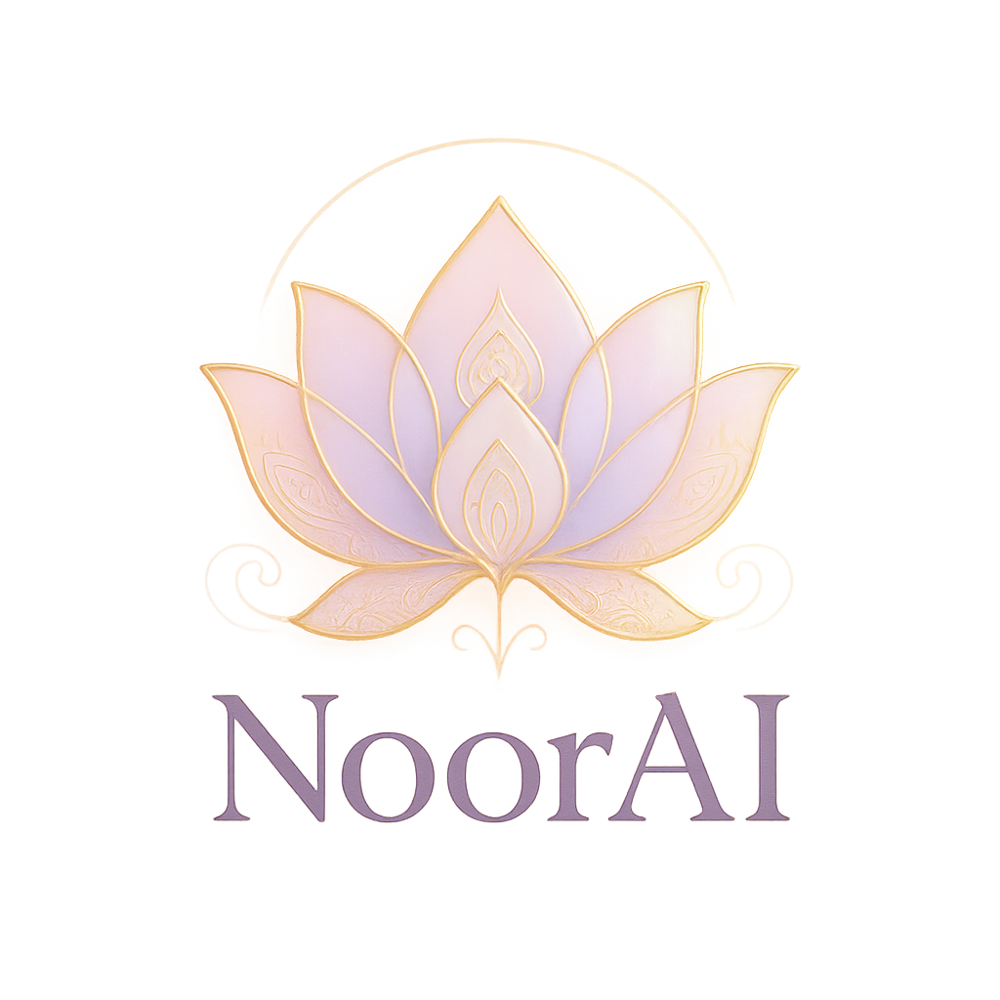

<p align="center">
  
</p>

---

<p align="center" style="font-size:1.25em;">
  <strong>NoorAI</strong><br>
  Empowering Beauty Through AI &amp; Indian Cultural Heritage
</p>

<p align="center">
  <i>"Noor" – The divine light that radiates from within.</i>
</p>

---

<p align="center">
  <a href="https://flutter.dev">
    
  </a>
  <a href="https://firebase.google.com">
    
  </a>
  <a href="https://deepmind.google/technologies/gemini/">
    
  </a>
  <a href="https://flutterflow.io">
    
  </a>
  <br>
  
  
</p>

---

## About NoorAI

NoorAI is a next-generation AI-powered beauty and skincare app crafted for the modern Gen Z audience. It gracefully blends the spiritual essence of Indian beauty rituals with cutting-edge AI (Google Gemini Vision) to deliver personalized skin analysis, culturally-rooted recommendations, and a luxurious user experience.

---

## Vision

Democratizing personalized skincare by fusing ancient Indian wisdom with advanced AI—celebrating glow, identity, and heritage.

## Mission

Empowering individuals with accessible, intelligent, and culturally respectful skincare solutions.

---

## Features

### AI-Powered Skin Analysis
- Real-time facial skin scan using Google Gemini Vision
- Detects acne, pigmentation, dryness, oiliness, fine lines
- Instant feedback, visual insights, and trackable skin history

### Personalized Recommendations
- Skincare routines tailored to your skin type and goals
- Product suggestions with Ayurvedic ingredients (e.g., turmeric, sandalwood)
- Combines Indian beauty traditions with science-backed advice

### Luxurious UI/UX
- Glassmorphism, gold lotus motifs, blush pinks, soft lavenders, ivory whites
- Mehendi-inspired borders and micro-interactions
- Elegant, intuitive, and accessible experience

### Privacy & Ethics
- No image storage by default
- End-to-end encrypted analysis
- GDPR compliance and strict data protection standards

---

## Tech Stack

| Layer     | Tool / Framework       | Purpose                                     |
|-----------|-----------------------|---------------------------------------------|
| Frontend  | Flutter + FlutterFlow | UI/UX, cross-platform mobile development    |
| Backend   | Firebase Suite        | Authentication, Firestore, Storage, Functions|
| AI/ML     | Gemini Vision         | Facial skin analysis & recommendations      |
| Storage   | Firebase Storage      | Asset management                            |
| Auth      | Firebase Auth         | Secure user access                          |
| Analytics | Firebase Analytics    | Engagement tracking                         |

---

## Getting Started

### Prerequisites

- Flutter SDK >= 3.16.0  
- Firebase CLI (`npm install -g firebase-tools`)  
- Git CLI (`git --version`)

### Installation

```bash
# Clone the repo
git clone https://github.com/Mr-Swapnil25/noorai-app.git
cd noorai-app

# Install Flutter packages
flutter pub get

# Login to Firebase
firebase login
```

#### Environment Setup

Create a `.env` file with:
```env
GEMINI_API_KEY=your_key
FIREBASE_PROJECT_ID=your_project_id
APP_NAME=NoorAI
DEBUG_MODE=true
```

#### Firebase Setup

```bash
firebase init
firebase firestore:indexes
cd functions
npm install
firebase deploy --only functions
```

#### Run the App

```bash
# Android
flutter run -d android

# iOS
flutter run -d ios

# Web
flutter run -d web
```

---

## Folder Structure

```
noorai-app/
├── lib/
│   ├── components/
│   ├── pages/
│   ├── backend/
│   ├── custom_code/
│   ├── flutter_flow/
│   └── main.dart
├── assets/
│   ├── images/
│   ├── logo/
│   ├── fonts/
│   └── sounds/
├── firebase/
│   ├── functions/
│   ├── firestore.rules
│   └── firebase.json
├── docs/
├── test/
├── pubspec.yaml
├── .env
└── README.md
```

---

## Design Language

### Color Palette

| Element           | Color Name     | Hex       |
|-------------------|---------------|-----------|
| Primary Lavender  | Soft Lavender | #CBA6F7   |
| Accent Gold       | Elegant Gold  | #F9E79F   |
| Background        | Ivory White   | #FFFFF7   |
| Detail Blush Pink | Soft Blush    | #F8BBD9   |
| Rose Gold Shadow  | Rose Tint     | #E8B4B8   |

### Typography

- **Primary Font:** Poppins
- **Accent Font:** Noto Sans Devanagari

---

## Testing

- **Unit Tests:**  
  ```bash
  flutter test
  ```
- **Widget Tests:**  
  ```bash
  flutter test test/widget/
  ```
- **Integration Tests:**  
  ```bash
  flutter drive --target=test_driver/app.dart
  ```

---

## Internationalization

**Supported Languages:**
- English 🇬🇧
- Hindi 🇮🇳
- Bengali 🇧🇩
- Tamil 🇮🇳
- Telugu 🇮🇳
- Marathi 🇮🇳

---

## Contributing

1. Fork the repo
2. Create a feature branch (`feature/your-feature`)
3. Push your changes and create a PR
4. Follow coding guidelines and write tests

---

## License

MIT License.  
Logo & branding assets © NoorAI, all rights reserved.  
See [LICENSE](LICENSE) for details.

---

## Acknowledgements

- Indian classical beauty traditions
- Google Gemini AI team
- FlutterFlow & Firebase communities
- Contributors and testers 💜

---

<p align="center">
  <br/>
  <b>Made with love to celebrate timeless beauty, powered by modern AI</b><br/>
  <i>“Noor” – The divine light within</i><br/>
  <sub>© 2025 NoorAI – All rights reserved.</sub>
</p>
